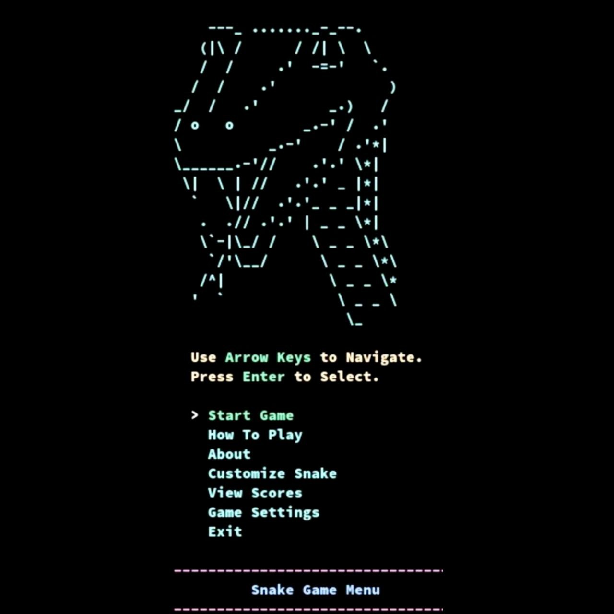
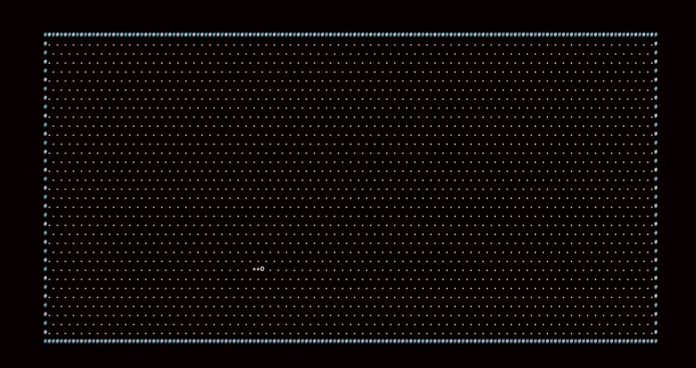

# Snake Game: Terminal Edition 🐍

Welcome to the **Snake Game: Terminal Edition** (`sgt`), a fun and interactive game built entirely for the terminal! Navigate menus, start the game, and enjoy an engaging experience using your keyboard. This project demonstrates real-time input handling in C with terminal-based interactivity.

## Features 🚀

- **Interactive Menus**: Use arrow keys to navigate through options.
- **Real-Time Key Handling**: Responsive keyboard input using raw terminal mode.
- **Dynamic Display**: Terminal menu updates in real-time ba user input.
- **Expandable Gameplay**: Built to serve as the foundation for a terminal-based Snake Game.

## Screenshots 📸

### Main Menu

Here is a preview of the **Game Menu**:



### Gameplay

Here is a preview of the **Snake Game** in action:



## Prerequisites 📋

Ensure you have the following installed:

- A C compiler (e.g., `gcc`)
- A terminal emulator (Linux/macOS recommended)
- Docker (if using Docker image installation)

---

## Installation 💾

You have two options to install and run **Snake Game: Terminal Edition** (`sgt`):

### **Option 1: Installation via Cloning the Repository**

Follow these steps to clone, build, and install the game manually on your system:

#### 1. **Clone the Repository**

Start by downloading the project repository to your local machine:

```bash
git clone https://github.com/medishen/sgt.git
cd sgt
```

#### 2. **Build the Program**

Next, build the program using `make`. This step compiles the source code into an executable binary.

1. **Run the `make` command** to compile the program:

   ```bash
   make
   ```

   This will:

   - Compile all `.c` files in the `src` directory into `.o` object files under the `obj` directory.
   - Link the object files to create the final executable named `sgt`.

#### 3. **Install the Executable (Optional)**

To make the `sgt` game available system-wide (so you can run it from anywhere in your terminal), you can install it into your system's `PATH`:

1. Run the following command with `sudo` to install the program to `/usr/local/bin`:

   ```bash
   sudo make install
   ```

   This step:

   - Copies the `sgt` executable to `/usr/local/bin`, a standard directory in your system's `PATH`.
   - Makes the game globally accessible from any terminal session.

2. You’ll see a confirmation message in the terminal, such as:

   ```
   sgt has been installed to /usr/local/bin
   ```

#### 4. **Run the Program**

After building (and optionally installing), you can start the game:

- If you installed the game system-wide, simply run:

  ```bash
  sgt
  ```

- If you didn’t install it, run it from the project directory:

  ```bash
  ./sgt
  ```

---

### **Option 2: Installation via Docker Image**

If you prefer not to manually compile the program, you can quickly set it up using Docker.

1. **Ensure Docker is Installed**

   Make sure you have Docker installed on your system. If not, follow the [installation instructions](https://docs.docker.com/get-docker/) for your platform.

2. **Pull the Docker Image**

   To use the pre-built Docker image, run the following command to pull the image from Docker Hub:

   ```bash
   docker pull bitsgenix/sgt
   ```

3. **Run the Docker Container**

   After pulling the image, you can start the container with:

   ```bash
   docker run --rm -it bitsgenix/sgt
   ```

   This command will start the game automatically inside the container.

4. **Interactive Mode**

   If you want to interact with the game in the terminal and keep it running interactively, you can use:

   ```bash
   docker run --rm -it bitsgenix/sgt /bin/bash
   ```

   Then, inside the container, run the game:

   ```bash
   sgt
   ```

---

## Contributing 🤝

Contributions are welcome! If you have ideas for enhancements or fixes:

1. Fork the repository.
2. Create a feature branch:
   ```bash
   git checkout -b feature-name
   ```
3. Commit your changes and push:
   ```bash
   git commit -m "Description of changes"
   git push origin feature-name
   ```
4. Open a Pull Request.

For more detailed information on how to contribute, please refer to the [CONTRIBUTING.md](./docs/CONTRIBUTING.md).

---

## Changelog 📜

For details on version updates, refer to the [CHANGELOG.md](./docs/CHANGELOG.md).

---

## Frequently Asked Questions ❓

For any questions or common issues, check out the [FAQ.md](./docs/FAQ.md).

---

## User Guide 📖

For detailed instructions on how to play the game, check out the [USER_GUIDE.md](./docs/USER_GUIDE.md).

---

## Software Requirements Specification (SRS) 📋

For a detailed technical specification of the game, please refer to the [SRS.md](./docs/SRS.md).

---

## License 📜

This project is licensed under the [MIT License](LICENSE).

---

### Additional Notes:

- **Docker Installation Details**:

  - The Docker image is pre-configured to run the game automatically. This is the easiest installation method, especially if you don't want to manually set up dependencies.
  - To use the Docker container, simply run `docker run --rm -it bitsgenix/sgt`, and the game will start directly.

- **Build Details in Docker**:
  The Dockerfile sets up the necessary environment, installs dependencies, compiles the source code, and makes the executable available in `/usr/local/bin/sgt`.

  If you'd prefer to customize your own build or test the source code locally, you can refer to **Option 1: Installation via Cloning the Repository** for a more manual approach.

---

Thank you for playing and contributing to **Snake Game: Terminal Edition**!
